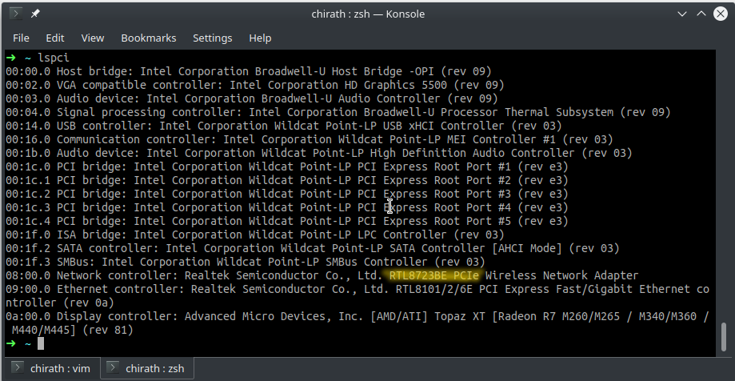

### Introduction

The first thing that might come to your mind is why should I install and use Linux instead of Windows that comes default 
with your new system. Few reasons we use Linux:

- Linux is open source.
- The commandline.
- Most of the servers run Linux.

You can read more about Linux from [opensource.com](https://opensource.com/resources/linux).

### Installation

It is generally recommended to go with the latest LTS release of Ubuntu(18.04 at the time of writing). Ubuntu is one of 
the most popular Linux distros and is strongly recommended for beginners due to the large community and forums.

A great guide to install Ubuntu can be found at [tutorials.ubuntu.com](https://tutorials.ubuntu.com/tutorial/tutorial-install-ubuntu-desktop#0).

### Learning outcomes

- Learn about different operating systems.
- Learn to make a bootable usb drive.
- Get an experience installing an OS.
- Learn about hard drive partitions.
- Learn to install drivers in Ubuntu.

### Additional resources

- https://howtoubuntu.org/how-to-install-ubuntu-18-04-bionic-beaver

### Common errors and issues

You might face some issue while installing Ubuntu on your system. It can be missing Wi-Fi, bluetooth or graphics 
drivers. Your battery might drain quickly or your laptop tends to get warm. Most of these issues can be fixed if you 
have enough patience and determination to find the solution. With enough patience and determination you can eventually 
find a fix online that would help you. Some of the common issues and fixes are mentioned below.

#### Wi-Fi
The most common issue you would face is missing Wi-Fi drivers. If you have a device that's been out for few months, 
it's highly likely that someone already fixed your issue and wrote a blog post or an answer in Ubuntu forums. To get 
the name of your Wi-Fi device open up a terminal(Usually ctrl + t) and then type the following command.

```bash
lspci
```

This command shows a list of all the PCI devices in your system. You will need to find your Wi-Fi card name from the 
list.



In my case my Wi-Fi card name is` Realtek RTL8723BE`, I can then google for `Realtek RTL8723BE driver install Ubuntu 
18.04` or something similar to get more info about installing this particular driver.

#### Laptop battery life

Ubnutu uses opensource graphics drivers by default which may result in more battery usage. An easy fix for this is to 
use tool like `Powertop` or `Tlp`. 
[Phoronix.com - Ubuntu tlp powertop](https://www.phoronix.com/scan.php?page=article&item=ubuntu2017-tlp-powertop&num=1)
is a good read on why to use Powertop or tlp. 
.
 
[help.ubuntu.com - power batterylife](https://help.ubuntu.com/stable/ubuntu-help/power-batterylife.html.en) provides documentation on how 
you can improve battery life on Ubuntu. 

#### Nvidia graphics drivers

Nvidia properatery drivers can be installed using the Additional drivers option in Ubuntu. You can get more info at 
[help.ubuntu.com - BinaryDriverHowto Nvidia](https://help.ubuntu.com/community/BinaryDriverHowto/Nvidia) 


### Laptop suggestions

In general most laptops that comes pre-installed with Ubuntu is highly recommended. You can also get one without a 
graphics card to avoid issues with battery life and driver installation. It would be good to research about the 
Linux support of a particular model before getting it. If possible try to stay away from the very latest, since 
these devices might not have open source drivers available. 

There are an overwhelming number of processors out there, so our suggestion would be to go with a laptop with the 
latest generation of Intel i3, i5 or an i7 processor. At the time of writing Intel released their 8th gen processor, 
which have 2 extra cores compared to the previous generation. This is a major update in processing power and we would 
suggest you to go with the most up to date generation of processors.

If you want to get a device with graphics card it is highly recommended to get one with Nvidia graphics to use the CUDA 
technology. This might be useful later if you are planing to do machine learning(but there is always the option of 
using cloud). 

With regards of RAM, any system with 8GB or more RAM is going to fine. And if you get one with 4GB, you can usually 
upgrade it to 8GM or more. Also if you have enough budget you can get your system with a SSD instead of an HDD. 
[howtogeek.com](https://www.howtogeek.com/howto/45359/htg-explains-whats-a-solid-state-drive-and-what-do-i-need-to-know) 
has an in interesting article on why you should be using an SSD.

#### Some 8th gen laptops

- Dell xps 13 or 15
- Dell Inspiron 5000 series
